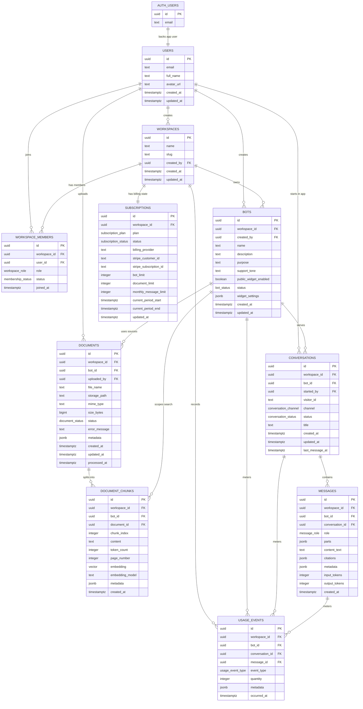

# Database Schema Plan

Review draft for Step 2 of [IMPLEMENTATION_PLAN.md](IMPLEMENTATION_PLAN.md). This file describes the proposed Supabase Postgres schema before migrations and API-layer data access are implemented.

## Step 2 Deliverables

- Add a SQL migration under `supabase/migrations/` for the tables, enums, indexes, and helper functions described here.
- Add a server-only Supabase service-role client for API routes and DB modules.
- Keep client code, REST API routes, and DB access modules separate.
- Ensure app components fetch data from API routes only, including Server Components.
- Do not add a browser Supabase data client or RLS policies. Realtime may use the public client later because that is the supported browser path.
- Document required Supabase environment variables and setup steps in `README.md`.

## Relationship Chart

## Table Use

| Table | How it will be used |
| --- | --- |
| `users` | One public application user per Supabase `auth.users` row. Used for account display, ownership metadata, and workspace member lists. In SQL, qualify this as `public.users` when there is any chance of confusion with Supabase `auth.users`. |
| `workspaces` | Tenant boundary for the SaaS app. Dashboard counts, billing, bots, documents, conversations, and API authorization checks are all scoped through this table. |
| `workspace_members` | Join table between users and workspaces. Drives workspace access, future team roles, and API membership checks. |
| `bots` | Chatbot project settings. Stores the bot identity, prompt-facing purpose/tone/fallback copy, widget availability, and widget theme settings. |
| `documents` | Uploaded source file metadata. Tracks Supabase Storage paths and ingestion state: `queued`, `processing`, `ready`, or `failed`. |
| `document_chunks` | Searchable knowledge units for RAG. Stores chunk text, stable chunk metadata, and a pgvector embedding for similarity search. |
| `conversations` | Chat sessions for either the in-app tester or the public widget. Groups messages and carries visitor/session metadata. |
| `messages` | Persisted user and assistant turns. Stores structured multimodal `parts`, plus derived text for previews/search, answer citations, token accounting, and debugging. |
| `subscriptions` | Current plan and billing state for each workspace. Used by Step 4, Step 5, Step 7, Step 9, and Step 10 to enforce limits. |
| `usage_events` | Append-only metering and activity stream. Tracks message counts, embedding usage, uploads, and other events for dashboards and plan limits. |

## Proposed Enums

- `workspace_role`: `owner`, `admin`, `member`
- `membership_status`: `active`, `invited`, `disabled`
- `bot_status`: `draft`, `ready`, `disabled`
- `document_status`: `queued`, `processing`, `ready`, `failed`
- `conversation_channel`: `app`, `widget`
- `conversation_status`: `open`, `closed`
- `message_role`: `system`, `user`, `assistant`, `tool`
- `subscription_plan`: `free`, `pro`, `business`
- `subscription_status`: `mock_active`, `trialing`, `active`, `past_due`, `canceled`
- `usage_event_type`: `message_sent`, `assistant_response`, `document_uploaded`, `document_ingested`, `embedding_generated`, `widget_loaded`

## Schema Notes By Area

### Workspaces And Membership

- `users.id` references `auth.users(id)` and is the app-level user identity used by workspace membership, ownership metadata, and account display.
- `workspaces.created_by` references `users(id)` and can be nullable on user deletion so workspace data does not vanish unexpectedly.
- `workspace_members` has a unique constraint on `(workspace_id, user_id)`.
- A workspace should be created with one `owner` member during onboarding in Step 3. Step 2 only needs the schema to support that flow.

### Should Membership Merge Into Users?

Recommendation: keep `workspace_members` separate from `users`.

Pros of merging membership fields into `users`:

- Fewer tables and joins for the single-workspace MVP path.
- Simpler onboarding insert if each user can only ever belong to one workspace.
- Easier mental model for early UI screens that only show one workspace.

Cons of merging membership fields into `users`:

- It only supports one workspace per user unless we later unwind the schema.
- It blocks future team membership where one user belongs to multiple workspaces with different roles.
- It mixes account identity (`users`) with tenant authorization (`workspace_members`), which makes API access checks and audits less clean.
- It makes workspace switching, invitations, disabled memberships, and ownership transfer harder to add.
- It creates awkward billing and data ownership edge cases when a user leaves a workspace but should keep their account.

If this project is permanently single-workspace-per-user, merging is acceptable. For this MVP, the existing plan already mentions workspace switching and team-ready settings later, so the join table is the safer default.

### Bots

- `bots.workspace_id` is the primary ownership scope for API authorization.
- `bots.created_by` references `users(id)` for audit and ownership display.
- `bots.widget_settings` should start as JSONB so Step 9 can add theme values without another migration. Expected keys: `primaryColor`, `launcherPosition`, `welcomeMessage`, `displayName`, `avatarUrl`, `removeBranding`.
- `bots.public_widget_enabled` gates public widget availability. Direct anonymous database access is not allowed; widget reads and writes go through server routes.

### Documents And Chunks

- `documents.storage_path` points to the Supabase Storage object in a bucket such as `source-documents`. This is a convention rather than a foreign key.
- `documents.workspace_id` and `document_chunks.workspace_id` duplicate the bot workspace to keep API authorization checks and common queries simple.
- `document_chunks.embedding` uses `vector(768)` for the MVP. Gemini embedding models support configurable output dimensions, and 768 keeps storage smaller while remaining one of Google's recommended output sizes.
- Deleting a document should cascade to its chunks.

### Conversations And Messages

- `conversations.started_by` is nullable because widget visitors may not be authenticated.
- `conversations.visitor_id` stores an anonymous widget session identifier. It should not be trusted for authorization.
- `messages.parts` is the canonical message payload. Store it as a JSONB array of typed parts, for example text parts and file parts.
- A text part should look like `{ "type": "text", "text": "What is on this picture?" }`.
- A file part should look like `{ "type": "file", "url": "<storage_path>", "filename": "5_articles.png", "mediaType": "image/png" }`.
- For file parts, store Supabase Storage object paths in `url`, not permanent public URLs. API routes can create signed URLs or provider-specific upload/file references when needed.
- `messages.content_text` is a derived plain-text field from text parts only. Use it for conversation previews, simple search, debugging, and usage displays; do not treat it as the source of truth.
- `messages.citations` stores retrieved source references returned with assistant answers. A typical citation item can include `document_id`, `document_name`, `chunk_id`, and `page_number`.
- `messages.workspace_id` and `messages.bot_id` are duplicated from the conversation to simplify API authorization, analytics, and future dashboard queries.

### Billing And Usage

- `subscriptions.workspace_id` should be unique so each workspace has one current billing state row.
- Limits are stored on `subscriptions` as a snapshot (`bot_limit`, `document_limit`, `monthly_message_limit`) even if the plan catalog is also represented in TypeScript. This makes mock billing and Stripe webhook updates easier.
- `usage_events` is append-only. Bot, conversation, and message references can use `on delete set null` so billing history survives normal cleanup while workspace deletion still cascades.
- Monthly message usage is computed from `usage_events` where `event_type` is `message_sent` or `assistant_response`, depending on the final billing rule.

## Data Access Boundary

- Client components and Server Components must not import Supabase clients or DB modules.
- UI data fetching goes through REST API routes under `app/api/**`.
- API routes validate the user session, check workspace membership in application code, and then call DB modules.
- DB modules use a server-only Supabase service-role client. The service role key must never be exposed to browser bundles.
- Do not add RLS policies for the MVP architecture. Authorization lives in the API layer because the database is only accessed from trusted server code.
- Realtime is the only public-client exception. If later steps need browser Realtime subscriptions, keep those clients scoped to Realtime channel usage and do not use them for CRUD data access.
- Public widget access should also be mediated by Next.js route handlers. Anonymous widget sessions receive only the bot/conversation data those routes explicitly return.

## Indexes And Functions

- Add B-tree indexes for every foreign key used in joins: `workspace_id`, `bot_id`, `document_id`, `conversation_id`, and `user_id`.
- Add primary and uniqueness constraints:
  - `users(id)` as the primary key and foreign key to `auth.users(id)`
  - `workspace_members(workspace_id, user_id)`
  - `subscriptions(workspace_id)`
  - `document_chunks(document_id, chunk_index)`
- Add `updated_at` triggers for mutable tables.
- Enable `vector` extension for pgvector.
- Add a vector index on `document_chunks.embedding`, preferably HNSW with cosine distance if available in the target Supabase Postgres version.
- Add a scoped search RPC, for example `match_document_chunks(target_workspace_id uuid, target_bot_id uuid, query_embedding vector(768), match_count int)`, that filters by workspace and bot. The API route remains responsible for validating the caller's workspace access before invoking it.

## Deletion Behavior

- Deleting a workspace cascades to workspace-owned application data.
- Deleting a bot cascades to documents, chunks, conversations, and messages.
- Deleting a document cascades to chunks and should also remove the related Storage object in application code.
- Usage events should retain historical billing/activity data where practical, with optional references set to null when bots, conversations, or messages are deleted.

## Review Questions Before Migration

- Confirm the Google Gemini API chat model before Step 7. The Step 2 schema fixes embeddings at 768 dimensions; changing that later requires a migration and re-embedding stored chunks.
- Confirm whether bot URLs and widget IDs should expose UUIDs only, or whether `bots.slug` should be added for human-readable routes.
- Confirm whether document deletion should be hard delete only for the MVP, or whether a `deleted_at` soft-delete column is needed.
- Confirm whether workspace members beyond the owner need invitations in the MVP, or whether the role fields are only future-ready.
